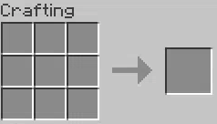

# Your First Scripts

If you have launched the game at least once, you will find `kubejs/server_scripts/example.js`. It looks like this:

```js
// priority: 0

// Visit the wiki for more info - https://kubejs.com/

console.info('Hello, World! (Loaded server scripts)')
```

### Breaking It Down

- `// priority: 0`  
    - Ensures this script is loaded first if you have multiple server scripts.  
    - Has no effect if there's only one server script.  

- `console.info('Hello, World! (Loaded server scripts)')`  
    - Prints the message in the log.  
    - This line is just an example and can be removed later.  

When the server scripts are loaded, this text is printed to the console. Neat, but not very useful on its own. So, how do we start tweaking recipes?

---

## Your First Recipes

KubeJS works by calling events and acting upon them. The `recipes` event can be used to add, remove, or replace recipes. Any modifications to recipes should be done within the context of a `recipes` event. Here's how to register an event listener for `ServerEvents.recipes`:

```js
ServerEvents.recipes(event => { // (1)
    console.log('Hello! The recipe event has fired!') // (2) (3)
});
```

1. You can replace `event` with any name, as long as you update it inside the callback too.  
2. The code inside the curly braces is the callback. You can modify as many recipes as you like here.
3. Like mentioned before, the `console.log` line can be removed, it is just here for demonstration purposes 

### Shapeless Recipes

A shapeless recipe allows players to place items anywhere on the crafting grid. Here's an example:

```js
event.shapeless('minecraft:dandelion', 3, [ // (1)
    'minecraft:bone_meal',
    'minecraft:yellow_dye', // (2)
    '3x minecraft:ender_pearl'
]);
```

1. **Output**: Produces 3 dandelions.  
2. **Input**: An array of items required for the recipe. Maximum item count is 9.

Putting that code into your recipe event listener and reloading the script will cause it to be registered, it's as simple as that! 

### Shaped Recipes

Shaped recipes define a specific pattern in the crafting grid. For example:

```js
event.shaped('minecraft:stone', 3, [ // (1)
    'A B',
    ' C ', // (2)
    'B A'
], {
    A: 'minecraft:andesite',
    B: 'minecraft:diorite', // (3)
    C: 'minecraft:granite'
});
```

1. **Output**: Produces 3 stone blocks.  
2. **Pattern**: The shape of the recipe (as an array of strings).  
3. **Mapping**: Defines what each letter in the pattern represents.  

Being an array, smaller patterns also work and will function as expected in a crafting grid:

```js
ServerEvents.recipes(event => {
    event.shaped('minecraft:bundle', [
        'S',
        'L'
    ], {
        S: 'minecraft:string',
        L: 'minecraft:leather'
    });
});
```

<figure markdown="span">
     
    <figcaption>For strict grid positions or disabling mirroring, see [here](https://pastebin.com/raw/yy3i5L5a).</figcaption>
</figure>

### Smelting and Stonecutting Recipes

Cooking recipes are all very similar, having an output (which can be up to 64 of the same item) and an input (a single item). Recipes can also be further modified by adding or adjusting their properties. For example, XP gained is set by appending `.xp()` to the recipe, and cooking time (in [ticks](https://minecraft.wiki/w/Tick "Minecraft's measurement of time, there are 20 ticks per second")) is set by appending `.cookingTime()`. 
```js 
event.smelting('3x minecraft:gravel', 'minecraft:stone') // (1)
event.blasting('10x minecraft:iron_nugget', 'minecraft:iron_ingot')
event.smoking('minecraft:tinted_glass', 'minecraft:glass').xp(0.35) // (2)
event.campfireCooking('minecraft:torch', 'minecraft:stick', 0.35, 600) // (3)
```

1. Cook 1 stone into 3 gravel in a Furnace.  
2. Grants 0.35 XP.  
3. Grants 0.35 XP and takes 600 ticks (30 seconds).  

Stonecutter recipes are largely the same, minus the `.xp` and `.cookingTime` properties:

```js
event.stonecutting('3x minecraft:stick', '#minecraft:planks')
```

Other types of recipes (including custom/modded recipes), as well as other modifiers, are covered [here](https://pastebin.com/raw/yy3i5L5a).

## Recipe Removal and Modification

To remove recipes, use `event.remove()` with a recipe filter:

```js
event.remove({ output: 'minecraft:stone_pickaxe' }); // (1)
```

1. **Filter**: Specifies which recipes to remove.  

Filters can target recipes by:

- **Output item**: `{ output: '<item_id>' }`  
- **Input item(s)**: `{ input: '<item_id>' }`  
- **Mod**: `{ mod: '<mod_id>' }`  
- **Recipe ID**: `{ id: '<recipe_id>' }`  
- **Combinations**:  
    - Require ALL conditions: `{ condition1: 'value', condition2: 'value2' }`  
    - Require ANY condition: `[ { condition_a: 'true' }, { condition_b: 'true' } ]`  
    - Negate a condition: `{ not: { condition: 'requirement' } }`  

??? examples

    ```js
        // Remove all recipes for stone pickaxes:
        event.remove({ output: 'minecraft:stone_pickaxe' });

        // Remove recipes using the Wool tag:
        event.remove({ output: '#minecraft:wool' });

        // Remove recipes using Redstone Dust:
        event.remove({ input: '#forge:dusts/redstone' });

        // Remove all recipes from Farmer's Delight:
        event.remove({ mod: 'farmersdelight' });

        // Remove campfire cooking recipes:
        event.remove({ type: 'minecraft:campfire_cooking' });

        // Remove all recipes for stone except smelting:
        event.remove({ not: { type: 'minecraft:smelting' }, output: 'stone' });

        // Remove recipes for cooked chicken on a campfire:
        event.remove({ output: 'minecraft:cooked_chicken', type: 'minecraft:campfire_cooking' });

        // Remove smelting or blasting recipes for iron ingots:
        event.remove([
            { type: 'minecraft:smelting', output: 'minecraft:iron_ingot' },
            { type: 'minecraft:blasting', output: 'minecraft:iron_ingot' }
        ]);

        // Remove a recipe by ID:
        event.remove({ id: 'minecraft:glowstone' });
    ```

Recipe inputs or outputs can be replaced in bulk with `event.replaceInput()` or `event.replaceOutput()`:

```js
event.replaceInput(
    { input: 'minecraft:leather' }, // (1)
    'minecraft:leather',            // (2)
    'kubejs:treated_leather'        // (3)
);
```

1. **Filter**: Selects recipes to modify.  
2. **Old Item**: The item to replace.  
3. **New Item**: The replacement item.  

## Your First Custom Items

!!! note
    Recall that custom items are done in the Startup Scripts folder, which means that changes done here will not come into effect until you relaunch Minecraft.

```js
StartupEvents.registry('item', event => { // (1)
  event.create('test_item') // (2)

  // If you want to specify a different texture location you can do that too, like this:
  event.create('treated_leather').texture('kubejs:item/earlygame/treated_leather') // (3)

  // You can specify item type as 2nd argument in create(), some types have different available methods
  event.create('custom_sword', 'sword').tier('diamond').attackDamageBaseline(10.0).displayName('My Sword') // (4)
})
```

1. Listens for the item registry event.  
2. The texture for this item has to be placed in `kubejs/assets/kubejs/textures/item/test_item.png`.  
3. This texture would be located at `kubejs/assets/kubejs/textures/item/earlygame/treated_leather.png`. You can use different mod IDs as well.  
4. If you want a custom model, you can create one in Blockbench and put it in `kubejs/assets/kubejs/models/item/custom_sword.json`. This is true for both items and blocks.

More info on the large variety of item builder methods available will be in its own page.

### Custom Blocks

Custom blocks are pretty similar to custom items, being registered during startup. Blocks, however, can heavily utilize the tag system (covered in more detail later on), allowing you to easily define many things.

```js
StartupEvents.registry('block', event => { // (1)  
    // Basic block example
    event.create('example_block') // (2)

    // An example of some of the methods and tags available
    event.create('example_block_2')
        .displayName('My Custom Block') // (4)
        .hardness(1.0) // (6)
        .resistance(1.0) // (7)
        .tagBlock('my_custom_tag') // (8)
        .requiresTool(true) // (9)
        .tagBlock('minecraft:mineable/axe') // (10)
        .tagBlock('minecraft:mineable/pickaxe') // (11)
        .tagBlock('minecraft:needs_iron_tool') // (12)
});
```

1. Listens for the block registry event.  
2. Create a new block with ID `kubejs:example_block`.  
3. Demonstrates various methods available for customizing blocks.  
4. Sets a custom display name for the block.  
6. Specifies the block's hardness, influencing mining time.  
7. Sets the block's [resistance to explosions](https://minecraft.wiki/w/Explosion).  
8. Tags the block with `#minecraft:my_custom_tag`.  
9. Requires a tool to drop the block when mined.  
10. Indicates the block can be mined faster with an axe.  
11. Or pickaxe.  
12. Requires a tool with at least iron tier to mine the block.

Like with items, blocks have a large number of methods available to you.

### Custom Fluids

Fluids are also like the above two; their methods can be found [here](https://pastebin.com/raw/yy3i5L5a).

```js
StartupEvents.registry('fluid', event => { // (1)
    // Basic Fluid example
  event.create('custom_fluid') // (2)
    .thickTexture(0xFF0000) // (3)
    .bucketColor(0xFF0000)
    .displayName('Custom Fluid')
                 
  // Fluid with custom textures
  event.create('strawberry_cream')
    .displayName('Strawberry Cream')
    .stillTexture('kubejs:block/strawberry_still')
    .flowingTexture('kubejs:block/strawberry_flow')
    .bucketColor(0xFF33FF) // (4)
})
```

1. Listens for the fluid registry event.  
2. Basic "thick" (looks like lava) fluid with red tint.  
3. `.thickTexture` is used to give it a "thick" (like lava) appearance, while `.thinTexture` gives it a "thin" appearance, has no bucket, and is not placeable.  
4. You can set a custom bucket appearance for the fluid as well.

## Client Events

The `client_scripts` folder contains scripts that are loaded every time client resources reload. These are used primarily for JEI events and tooltips.

Remember that you can reload all code inside of this folder by pressing `F3 + T`, or you can reload all code outside of any event listeners by running `/kubejs reload client_scripts`.

### Hiding Items from JEI

Note that items hidden from JEI will still be able to be crafted. Thus, it is recommended to create a "Nukescript" that both hides the item and removes its recipes with just one input. Info on that can be found [here](https://pastebin.com/raw/yy3i5L5a).

```js
JEIEvents.hideItems(event => {
    event.hide("sophisticatedstorage:copper_barrel") // (1)
    event.hide(/^sophisticatedstorage:limited.+barrel.+$/) // (2)
})
```

1. Hides the copper barrel item from appearing in JEI.  
2. Hides anything that matches the regex filter from appearing in JEI.

Regex (the pink text) and other methods of saving time are covered in the "saving time" section.

### Tooltips

Tooltips are the text that appears below an item's name in-game. 

```js
ItemEvents.tooltip(tooltip => {
    tooltip.add("minecraft:redstone_ore", 'Does not produce a redstone signal'); // (1)
    tooltip.add("minecraft:deepslate_redstone_ore", Text.translatable("item.minecraft.deepslate_redstone_ore.tooltip")); // (2)
})
```

1. Item, text. Regex and arrays work here, but not tags, as those are registered later.  
2. Localization is covered in a later section, but it is worth mentioning now.

Alongside the straightforward `tooltip.add`, `tooltip.addAdvanced` lets you get a bit more creative, covered in the tooltip events section.

<!-- ```js
ItemEvents.tooltip(tooltip => {

    tooltip.addAdvanced('minecraft:beacon', (item, advanced, text) => {
        if (!tooltip.shift) { // (1)
          text.add(1, [Text.of('Hold ').gold(), Text.of('Shift ').yellow(), Text.of('to see more info.').gold()])
        } else {
          text.add(1, Text.green('Gives positive effects to players in a range').bold(true))
          text.add(2, Text.red('Requires a base built out of precious metals or gems to function!'))
          text.add(3, [Text.white('Iron, '), Text.aqua('Diamonds, '), Text.gold('Gold '), Text.white('or even '), Text.green('Emeralds '), Text.white('are valid base blocks!')])
        }
    })
})
```

1. Shift, alt, and ctrl are all keys you can check! -->
